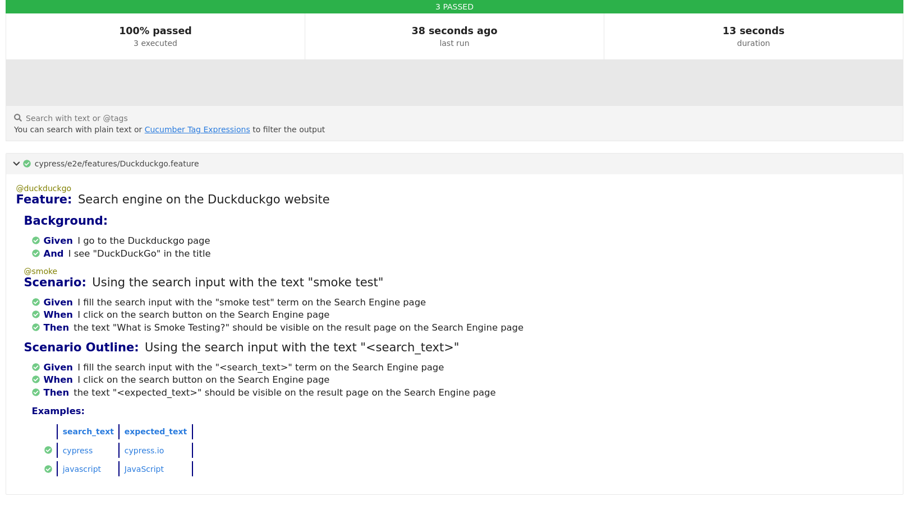

[](https://github.com/prettier/prettier)

# BDD base project: Cypress + Cucumber + Javascript

Basic example of using Cypress with Cucumber (BDD). This `Gherkin` example includes:
- Basic Scenario
- Scenario Outline
- Tagged tests

# Table of contents

* [Get started](#get-started)
  * [Installation](#installation)
* [How to run the tests](#how-to-run-the-tests)
  * [Running tests](#running-tests)
  * [Running tagged tests](#running-tagged-tests)
    * [Running tagged smoke tests](#running-tagged-smoke-tests)
    * [Running using customized tags](#running-using-customized-tags)
  * [Running tests manually](#running-tests-manually)
* [Static code analysis tools](#static-code-analysis-tools)
  * [ESLint](#eslint)
    * [Find Problems](#find-problems)
    * [Fix Automatically](#fix-automatically)
* [Issues](#issues)
* [License](#license)

# Get started

## Installation

```bash
npm install
```

# How to run the tests

## Running tests

```bash
npm test
```

**`output`**: an output is generated for each `.feature` file found.

```bash
    Spec                                              Tests  Passing  Failing  Pending  Skipped
┌────────────────────────────────────────────────────────────────────────────────────────────────┐
│ ✔  Duckduckgo.feature                      00:10        3        3        -        -        -  │
└────────────────────────────────────────────────────────────────────────────────────────────────┘
  ✔  All specs passed!                       00:10        3        3        -        -        -
```



## Running tagged tests

### Running tagged smoke tests

```bash
# defined in package.json file
npm run tag:smoke
```

### Running using customized tags

```bash
npx cypress run --env tags='@smoke and @duckduckgo'
```

*more details*: [tags](https://github.com/badeball/cypress-cucumber-preprocessor/blob/master/docs/tags.md)

## Running tests manually

Open **`Cypress`** and run the tests manually:

```bash
npm run cypress:open
```

# Static code analysis tools

## ESLint

### Find Problems

ESLint statically analyzes the code to find problems.

```bash
npm run lint
```

### Fix Automatically

Many problems ESLint finds can be automatically fixed.

```bash
npm run lint:fix
```

# License

[MIT](./LICENSE)
